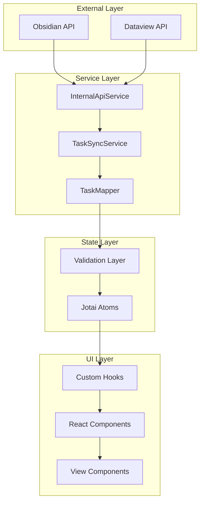
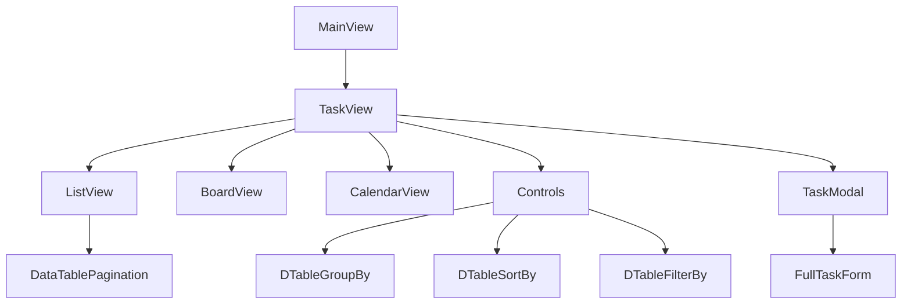
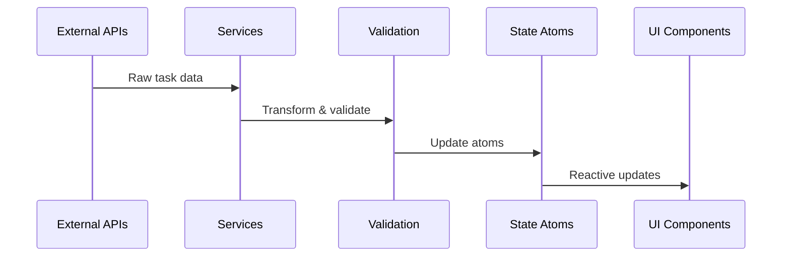
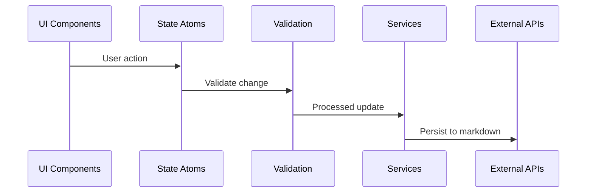

# System Architecture - Shards MD

## Architectural Overview

Shards MD follows a layered architecture with clear separation of concerns, ensuring maintainable, testable, and scalable code. The system implements unidirectional data flow with comprehensive type safety and validation at each layer.



## Core Architectural Principles

### 1. Single Source of Truth

-   **Jotai atoms** serve as the sole source of truth for application state
-   All components derive state from atoms, never maintain independent state for shared data
-   Markdown files remain the ultimate data source, with UI state as a reflection

### 2. Unidirectional Data Flow

-   Data flows from external sources → services → validation → state → UI
-   UI updates flow through validation → state → services → external sources
-   No circular dependencies or bidirectional data binding

### 3. Type Safety Throughout

-   **TypeScript** provides compile-time type checking
-   **Zod schemas** provide runtime validation
-   All data transformations are type-safe and validated

### 4. Service-Oriented Architecture

-   Clear separation between data access, business logic, and presentation
-   Services handle external integrations and complex operations
-   Components focus purely on presentation and user interaction

## Layer Details

### External Integration Layer

**Purpose**: Interface with Obsidian and Dataview APIs
**Components**:

-   `InternalApiService`: Primary API interface
-   Dataview API integration
-   File system operations

```typescript
// Key interfaces for external data
interface STask {
	// Dataview's internal task structure
}

class InternalApiService {
	private async initiatePeriodicTaskFetch(): Promise<void>;
	public async updateTask(task: Task): Promise<taskObject>;
	public async deleteTask(taskId: string): Promise<boolean>;
}
```

### Service Layer

**Purpose**: Business logic and data transformation
**Components**:

1. **TaskSyncService**: Orchestrates synchronization between UI and markdown
2. **TaskMapper**: Handles data format transformations
3. **TaskService**: Core task management operations

```typescript
class TaskSyncService {
	private remoteUpdateHandler(tasks: Task[]): void;
	private localUpdateHandler(change: TaskChange): void;
}

class TaskMapper {
	public mapDvToTaskType(dvTask: dvTaskType): Task;
	public mapTaskToLineString(task: Task): string;
	public mapMdToTaskType(lineString: string): Task;
}
```

### State Management Layer

**Technology**: Jotai for atomic state management
**Design Pattern**: Atomic state with derived computations

```typescript
// Base storage atom
const baseTasksAtom = atom<Task[]>([]);

// Operations atom with validation
const changeTasksAtom = atom(
	(get) => get(baseTasksAtom),
	(
		get,
		set,
		change: {
			operation: storeOperation;
			tasks: Task[];
		},
	) => {
		// Validate and apply changes atomically
	},
);

// Derived atoms for specific use cases
const filteredTasksAtom = atom((get) =>
	get(changeTasksAtom).filter(/* filter logic */),
);
```

### Validation Layer

**Purpose**: Ensure data integrity and type safety
**Implementation**: Zod schemas with custom validation functions

```typescript
export const TaskSchema = z.object({
	id: z.string(),
	description: z.string(),
	priority: z.nativeEnum(TaskPriority),
	status: z.nativeEnum(TaskStatus),
	// ... additional fields
});

export function validateTask(task: unknown): ValidationResult;
export function validateTasks(tasks: unknown[]): asserts tasks is Task[];
```

### UI Layer Architecture

**Framework**: React with functional components and hooks
**Patterns**:

-   Container/Presentation pattern
-   Custom hooks for state management
-   Atomic component design

#### Component Hierarchy



#### Custom Hooks

```typescript
// Core table management hook
function useTaskTable(config: TableConfig) {
	// TanStack Table integration
	// State management via Jotai
	// Action handlers
	return { table, actions };
}

// Task-specific atom hook
function useTaskAtom(taskId: string) {
	const taskAtom = useMemo(
		() =>
			atom(
				(get) => get(changeTasksAtom).find((t) => t.id === taskId),
				(get, set, update: Partial<Task>) => {
					// Validated updates
				},
			),
		[taskId],
	);
	return useAtom(taskAtom);
}
```

## Data Flow Architecture

### Read Operations (External → UI)



### Write Operations (UI → External)



## Key Design Decisions

### 1. Jotai Over Redux/Context

**Decision**: Use Jotai for state management
**Rationale**:

-   Atomic updates reduce unnecessary re-renders
-   Better TypeScript integration
-   Simpler mental model for component-level state
-   Excellent performance characteristics

### 2. TanStack Table Integration

**Decision**: Build on TanStack Table for complex table functionality
**Rationale**:

-   Mature, well-tested table solution
-   Flexible column and row management
-   Built-in sorting, filtering, grouping
-   TypeScript-first design

### 3. Service Layer Abstraction

**Decision**: Abstract external APIs behind service layer
**Rationale**:

-   Easier testing and mocking
-   Flexibility to change external integrations
-   Clear separation of concerns
-   Consistent error handling

### 4. Zod for Runtime Validation

**Decision**: Use Zod schemas for all data validation
**Rationale**:

-   Runtime type safety
-   Consistent validation across layers
-   Excellent TypeScript integration
-   Clear error messaging

## Performance Considerations

### State Management Performance

-   Atomic updates minimize re-renders
-   Derived atoms compute only when dependencies change
-   Memoized selectors prevent unnecessary calculations

### Synchronization Performance

-   Debounced updates to prevent excessive API calls
-   Batch operations for multiple changes
-   Optimistic updates for immediate UI feedback

### Memory Management

-   Proper cleanup of event listeners
-   Atom garbage collection when components unmount
-   Efficient data structures for large task lists

## Security & Data Integrity

### Data Validation

-   All external data validated before entering state
-   Type assertions ensure runtime safety
-   Schema validation prevents malformed data

### State Protection

-   Immutable update patterns
-   Validation before state mutations
-   Rollback mechanisms for failed operations

### External API Safety

-   Error boundaries around external operations
-   Graceful degradation when APIs fail
-   Data backup before destructive operations

## Testing Strategy

### Unit Testing

-   Service layer functions
-   Validation functions
-   Custom hooks
-   Component logic

### Integration Testing

-   Service integration with APIs
-   State management flows
-   Component interactions

### End-to-End Testing

-   Complete user workflows
-   Data synchronization scenarios
-   Error handling paths
