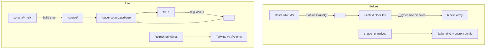

# refactor: Migrate BaseHub + shadcn → Fumadocs + RetroUI

## Overview

Replace BaseHub CMS with Fumadocs content source (local MDX) and replace shadcn/Radix UI primitives with RetroUI on Next.js 16 + React 19. Upgrade Tailwind v3.4 → v4 to meet RetroUI's documented install path. Preserve neobrutalism visual identity (custom shadows, radii, fonts). Branch: `neon-building`.

This is a refactor, not a feature. There is no new product behavior. The plan converts a CMS-backed runtime fetch pipeline to a build-time MDX pipeline, rewires the UI primitive layer, and rebases CSS tokens onto v4 syntax. Site shell, animated project cards, and theme behavior are preserved; body copy ships as placeholder MDX (user populates real content post-migration).

---

## Problem Frame

The site currently couples three layers that each carry technical debt:

1. **Content** lives in BaseHub. Every page issues a runtime GraphQL query via `<Pump>`; type generation produces a 3,238-line `basehub-types.d.ts` with `@ts-nocheck`; `pnpm dev` requires a running BaseHub draft sync; `BASEHUB_TOKEN` is required to boot. For a single-author personal site with three routes (`/`, `/legal`, dynamic `/icon`), this is mismatched.
2. **UI primitives** are shadcn `new-york` over Radix, with a partial neobrutalism CVA layer baked into `Button`/`Card`/`Popover`. Five primitives (`Dialog`, `Select`, `Label`, `Tooltip`, `Carousel`) have zero JSX consumers — pure drag.
3. **Tokens** are split between `tailwind.config.ts` `theme.extend` and `:root`/`.dark` CSS vars, with several latent bugs (`--main` referenced but never defined; `oklch(95 0 0)` instead of `oklch(0.95 0 0)`).

RetroUI ships `@theme {}` syntax expecting Tailwind v4. Adopting RetroUI forces v4. Adopting Fumadocs lets us delete BaseHub. Doing both at once is justified because the failure surfaces are independent (content layer vs. styling vs. components) and the cleanup is single-author.

---

## Requirements Trace

- R1. Site shell renders correctly on `/` and `/legal` after migration (Nav, Section, Footer, animated project cards, theme toggle). Body copy is intentionally placeholder — content parity is post-migration work.
- R2. `BASEHUB_TOKEN` is no longer required to build, run, or deploy.
- R3. Content authoring moves to local `.mdx` files under `content/`; editing requires only `pnpm dev` and a text editor.
- R4. Tailwind v4 is the active version; `@tailwindcss/postcss` replaces v3 PostCSS.
- R5. RetroUI is the source of UI primitives where parity exists; Radix is retained only for components RetroUI does not ship (NavigationMenu, HoverCard).
- R6. Custom hover utilities (`hover-grow`, `hover-lift`, etc.) and project-specific animations (`float`, `wiggle`, `shimmer`, `pulse`) survive verbatim.
- R7. `pnpm build` and `pnpm test` are green at every shipped commit.
- R8. Each shipped commit can be reverted independently — no flag-day merge.

---

## Scope Boundaries

- No new pages, routes, or features. Standalone projects route remains unmounted.
- No design changes. Brutalist radii (`8/16/24px`), shadow offsets, and accent palette stay.
- No internationalization beyond what BaseHub already encoded — `/legal` still surfaces a single locale by default. EN + DE MDX files exist as a parity preserve, but the route does not introduce a language switcher.
- No backend, no database, no API routes.
- No live-preview workflow. BaseHub draft mode is replaced by git-based content workflow; this is accepted.
- **Content not migrated.** All MDX files ship with placeholder content (lorem ipsum or short stubs). User populates real copy post-migration. Plan covers infrastructure only.

### Retained (load-bearing for migration)

- **`src/components/sections/components/projects/{stride,indexed,shards}.tsx`** + **`src/components/sections/components/projects/hover-visuals/*`** (~1,500 LOC of framer-motion SVG / 3D animated card visuals). These are the per-slug animated card components dispatched by `<Project slug="..."/>` MDX component. They were unmounted under BaseHub; under Fumadocs they become the rendering target for inline project references in hero MDX. **Do not delete in U13.**

### Deferred to Follow-Up Work

- **Standalone projects route** (e.g. `/projects/[slug]`): future PR. Inline `<Project slug="..."/>` use in hero MDX is in scope; a dedicated route is not.
- **Stagewise toolbar (`@stagewise/toolbar-next`)**: kept as-is until a separate dep audit. Out of scope here. (Resolution recorded under §Open Questions, "Stagewise toolbar".)
- **Visual regression harness (Chromatic / Playwright snapshots)**: recommended but optional. If skipped, characterization tests carry the regression-detection load.

---

## Context & Research

### Relevant Code and Patterns

- **BaseHub query surface (small)**: `src/app/page.tsx`, `src/app/layout.tsx`, `src/app/legal/page.tsx`, `src/app/legal/layout.tsx`, `src/app/icon.tsx`, `src/components/shared/social-buttons.tsx`. Inline blocks resolved via `__typename` in `src/components/shared/richtext-block.tsx` and `src/components/shared/richtext/callout.tsx`.
- **Rich-text rendering**: `src/components/shared/richtext-block.tsx` (220 lines) and `src/components/shared/richtext/callout.tsx` (358 lines, nests another `<RichText>` for callout content). These two files concentrate ~85% of the BaseHub-coupled rendering logic.
- **Slot composition** (load-bearing): `Button asChild` over `<Link>` in `navbar.tsx`, `footer.tsx`, `social-buttons.tsx`, `icon-link.tsx`, `theme-select.tsx`. `HoverCardTrigger asChild` in three richtext hover cards. `motion.create(Button)` in `scroll-arrow.tsx:9,199`. RetroUI Button has `forwardRef` + `asChild` Slot — verified compatible.
- **Custom CVA primitives kept**: `typography.tsx` (894 lines), `neoBadge.tsx`, `section.tsx`, `background-grid.tsx`, `icon-link.tsx`. RetroUI does not ship Badge.
- **Existing tests**: `social-buttons.test.tsx` (mocks BaseHub — must be rewritten to a static fixture early), `color-select.test.tsx`, `randomCardProps.test.ts`, `active-theme.test.tsx` (placeholder).

### Institutional Learnings

- `docs/solutions/` does not exist. This migration is a candidate seed for `/ce-compound` afterward.
- `AGENTS.md`: pnpm only; never run `pnpm dev` from agents (manual command); never use raw HTML text elements (use `@/components/ui/typography`); never create custom shadows/borders/grids — use component variants and `Section` columns. Verify with `pnpm check` → `pnpm build` → `pnpm test`. The `build` script runs `basehub` first today — must be edited as part of U12.
- Referenced `.claude/rules/*.md` files do not exist on disk; README/AGENTS links are stale.

### External References

- Fumadocs headless / source-api / page-conventions: `https://fumadocs.dev/docs/headless`, `…/source-api`, `…/page-conventions`
- Fumadocs MDX collections / next adapter: `https://fumadocs.dev/docs/mdx/collections`, `…/mdx/next`
- Tailwind v4 upgrade: `https://tailwindcss.com/docs/upgrade-guide`, `https://tailwindcss.com/docs/theme`, `https://tailwindcss.com/blog/tailwindcss-v4`
- shadcn v4 migration notes: `https://ui.shadcn.com/docs/tailwind-v4`
- `tw-animate-css` (replaces `tailwindcss-animate` for v4): `https://github.com/Wombosvideo/tw-animate-css`
- RetroUI registry: `https://github.com/Logging-Studio/RetroUI/tree/main/components/retroui`, install docs `https://www.retroui.dev/docs/install/nextjs`
- Codemod: `npx @tailwindcss/upgrade@latest` (handles ~80%; misses `@theme inline`, `tailwindcss-animate` swap, custom `@utility` rewrites — see U3)

---

## Key Technical Decisions

- **Commit to Tailwind v4**: RetroUI assumes v4; staying on v3 means hand-porting RetroUI's `@theme` for every component installed. Reversal cost is one revert. (R4)
- **Sequencing — "Path A" (Tailwind first)**: Ship Tailwind v4 alone, verify production parity, then start content/UI work. Reasoning: independent failure modes; one revert if visual regressions surface; bisect surface stays clean. Path B (content first, then Tailwind) and Path C (parallel branches) discussed in §Alternatives Considered.
- **Single linear branch on `neon-building`**: PRs merge into `neon-building`; fast-forward to `main` after final bake. No feature flags, no parallel branches. Migration is single-author and short-lived; flag infrastructure would outlast its purpose.
- **Locale routing for legal**: Two MDX files (`content/legal/en.mdx`, `content/legal/de.mdx`); single `/legal` route picks `en` as default. No `/legal/[lang]` route, no language switcher UI. Origin doc's BaseHub query already filtered by `_title === 'English'`; preserving that single-locale UX. (R1, R3)
- **Socials as TS const, not Fumadocs collection**: `src/lib/socials.ts` typed array. Three-fields-plus-SVG with no body content doesn't justify a Fumadocs collection round-trip; TS literal handles raw SVG strings without YAML escaping pain. (R3)
- **Icon strategy**: Keep raw SVG strings in `src/lib/socials.ts` (preserves custom Logoipsum-style icons that lucide doesn't have). `basehub/react-icon` swap → inline `<span dangerouslySetInnerHTML>`. Author-time trust boundary; SVGs are pre-sanitized at author time.
- **`<Project slug="..."/>` MDX components do their own RSC lookup**: replaces BaseHub's parallel `blocks[]` resolved-data channel. Single source of truth per project; `source.getPage(slug)` is a Map lookup, not I/O.
- **Delete 5 unused primitives**: `dialog.tsx`, `select.tsx`, `label.tsx`, `tooltip.tsx`, `carousel.tsx` — zero consumers. Drop `embla-carousel-react`, unused Radix deps (`accordion`, `dropdown-menu`, `scroll-area`, `tabs`, `toast`).
- **Card.Footer gap**: RetroUI Card has no `Footer`. Replace `<CardFooter>` callsites in `project-card.tsx` with a plain `<div>` carrying the existing classNames. (R5)
- **Bump `sonner` `^2.0.2 → ^2.0.3`**: matches RetroUI Sonner wrapper's tested floor. Caret already permits, but lockfile may lag.
- **Preserve custom CVA props lost in RetroUI swap**: `Card`'s `variant`/`shadow`/`borderStyle`/`rotation`/`interactive`/`spacing` props become a project-local `cardVariants` className helper used at consumer sites, not part of the RetroUI namespace. (R6)
- **Fix latent Tailwind bugs while in there**: `--main` referenced by `tailwind.config.ts` `overlay` token but never defined — switch to `--primary`. `oklch(95 0 0)` lightness values normalized to `oklch(0.95 0 0)`.

---

## Open Questions

### Resolved During Planning

- **Locale routing for legal**: single `/legal` route, default `en`, EN+DE files coexist (decision above).
- **Projects route**: deferred — visuals stay in repo, route stays unmounted.
- **Socials icons**: keep raw SVG strings in `src/lib/socials.ts`; no lucide swap (decision above).
- **Tailwind v4 commit**: yes, Path A (decision above).
- **Radius**: keep current `8/16/24px` (visual identity).
- **Draft / live preview loss**: accepted; git-based content workflow.
- **Stagewise toolbar**: kept; out of scope.

### Deferred to Implementation

- **Exact `Card` className helper API**: design during U8 — discover whether one wrapper or per-prop helpers reads cleanly at callsites.
- **`src/lib/socials.ts` SVG sanitization**: choose between (a) author-time trust + `dangerouslySetInnerHTML` or (b) DOMPurify wrap. Implementation-time call once we see the SVG content.
- **Whether Tailwind v4 codemod (`npx @tailwindcss/upgrade`) covers this codebase cleanly**: discoverable in U3 (codemod runs as starting point of that unit).
- **Whether `tw-animate-css` covers every Radix `data-[state=open]:animate-*` variant the navbar/menu use**: discoverable at U3 build.

---

## High-Level Technical Design

> *This illustrates the intended approach and is directional guidance for review, not implementation specification. The implementing agent should treat it as context, not code to reproduce.*



**Content dispatch flip** (the most consequential rewire):

```
BaseHub:  query() -> { content.json, blocks: [{ __typename, ...resolved }] }
          richtext-block iterates blocks, dispatches by __typename

Fumadocs: <Project slug="stride"/>  in MDX
          Component receives { slug }, calls loader.getPage([slug], "projects")
          Renders ProjectHoverCard with looked-up data
```

The new model removes the parallel `blocks[]` channel; each inline reference becomes a self-contained RSC that resolves its own data via the in-memory source index.

---

## Output Structure

```
content/
  home/
    index.mdx
  legal/
    en.mdx
    de.mdx
  projects/
    <slug>.mdx
  experience/
    <slug>.mdx

source.config.ts                  (new, root)
src/lib/source.ts                 (new — loader bindings)
src/lib/site-meta.ts              (new — TS const for mainMeta + flags)
src/lib/socials.ts                (new — TS const for socials with raw SVG)
src/mdx-components.tsx            (new — MDX components map)
src/app/icon.svg                  (new — replaces dynamic icon.tsx)
src/components/retroui/           (new — vendored via shadcn add)
  Button.tsx
  Card.tsx
  Popover.tsx
  Command.tsx
  Sonner.tsx

src/components/ui/                (kept files only after U13)
  typography.tsx
  neoBadge.tsx
  section.tsx
  background-grid.tsx
  icon-link.tsx
  expandable-card.tsx
  navigation-menu.tsx             (kept Radix, restyled)
  hover-card.tsx                  (kept Radix, restyled)

src/components/sections/components/projects/   (kept — load-bearing for <Project> MDX dispatch)
  stride.tsx                      (StrideAnimatedCard, 3D / framer-motion)
  indexed.tsx                     (IndexedAnimatedCard)
  shards.tsx                      (ShardsAnimatedCard)
  hover-visuals/
    indexed-hover.tsx
    obsidian-task-hover.tsx
    shards-agents-hover.tsx
    shared-layers.tsx
    stride-hover.tsx
    index.ts                      (visualMap keyed by slug)
    types.ts

# Deleted: dialog.tsx, select.tsx, label.tsx, tooltip.tsx, carousel.tsx,
#          button.tsx, card.tsx, popover.tsx, command.tsx, sonner.tsx

# Removed deps: basehub, graphql, embla-carousel-react,
#               @radix-ui/react-accordion, @radix-ui/react-dropdown-menu,
#               @radix-ui/react-scroll-area, @radix-ui/react-separator,
#               @radix-ui/react-tabs, @radix-ui/react-toast,
#               tailwindcss-animate

# Removed files: basehub.config.ts, basehub-types.d.ts,
#                src/__mocks__/basehub.ts
```

---

## Implementation Units

> **Deepening note:** U1 (three-spike branch) was removed after scope-guardian review — for a single-author personal site, dedicated spike ceremony adds cost without proportional protection. Pre-flight checks fold inline into U3 (Tailwind upgrade), U5 (MDX components map), and U9 (Button ref forwarding). U-ID gap preserved per stability rule.

- U2. **Characterization test: `motion.create(Button)` ref forwarding**

**Goal:** Lock the one piece of behavior that cannot be eyeball-verified. The other behaviors (rich-text rendering, legal layout, navbar socials) are captured by visual diff at U3/U6/U7 — paying for them twice via tests is overhead.

**Requirements:** R1, R7

**Dependencies:** None.

**Files:**
- Create: `src/components/__tests__/scroll-arrow.test.tsx`

**Approach:**
- Render `<ScrollArrow/>`; assert ref forwards through `motion.create(Button)` (forward a ref, assert `ref.current instanceof HTMLElement`).
- This test is the canary for U9 (RetroUI Button swap). If RetroUI Button drops `forwardRef`, this fails.

**Execution note:** Characterization-first. Must be green on `neon-building` before U9 ships.

**Patterns to follow:**
- Existing `color-select.test.tsx` for `@testing-library/react` setup.
- `jest.setup.ts` already mocks `ResizeObserver` and `Element.prototype.scrollIntoView`.

**Test scenarios:**
- Happy path: ref forwards through `motion.create(Button)` to underlying `<button>` element.
- Edge case: motion HOC mounts/unmounts via `AnimatePresence` without leaking refs.

**Verification:**
- `pnpm test` green; deliberately breaking ref-forwarding in `scroll-arrow.tsx` fails the test (proves coverage is real).

---

- U3. **Tailwind v3 → v4 upgrade**

**Goal:** Migrate the styling pipeline to v4 with no visual regressions. Promote to `main` before starting downstream work; if regressions surface, revert is one commit.

**Requirements:** R4, R6, R1

**Dependencies:** U2 (ref-forwarding canary).

**Files:**
- Modify: `package.json` (add `tailwindcss@^4`, `@tailwindcss/postcss@^4`, `tw-animate-css`; remove `tailwindcss@^3.4.16`, `autoprefixer`, `tailwindcss-animate`)
- Modify: `postcss.config.cjs`
- Modify: `src/app/globals.css` (replace `@tailwind` directives with `@import "tailwindcss"`; add `@theme inline {}` block; add `@custom-variant dark (&:where(.dark, .dark *))`; add `@utility translate-boxShadowX/Y` and reverse variants; keep `@layer components` hover utilities verbatim; fix `oklch(95 0 0)` → `oklch(0.95 0 0)` lightness normalization)
- Delete: `tailwind.config.ts` (or trim to plugin-only stub)
- Modify: `components.json` (fix `tailwind.config.js` typo to point at `globals.css` per shadcn v4 convention)

**Approach:**
- Run `npx @tailwindcss/upgrade@latest` on a clean working tree as starting point (this folds in the former Spike A — an observation pass on what the codemod produces). Hand-fix:
  - Re-add `@theme inline` qualifier (codemod drops it; without it dark mode breaks because v4 inlines values at build).
  - Migrate custom `translate.boxShadowX/Y` and reverse variants to `@utility` declarations.
  - Swap `tailwindcss-animate` for `tw-animate-css` via `@import "tw-animate-css"`.
  - Add `@plugin "@tailwindcss/typography"` declaration in `globals.css`.
  - Replace `--shadow-{sm,md,lg}-{x,y}` consumption with `@theme` `--shadow-sm/md/lg` synthesized from existing offset vars.
- Audit class-name parity per the v3→v4 breakage list:
  - `shadow-sm` semantics shift; explicit `--shadow-sm` declaration in `@theme` preserves visual.
  - `border` (no color) defaults to `currentColor` in v4 — audit shadcn primitive classNames; add explicit `border-border` where missing.
  - `outline-none` → `outline-hidden`.
  - `bg-opacity-*` removed → audit; replace with slash syntax.
  - `flex-shrink-0` → `shrink-0`; `overflow-ellipsis` → `text-ellipsis`.
  - `transform-none` → `scale-none/rotate-none/translate-none`.
- **Pre-flight: grep `bg-overlay` consumers.** `tailwind.config.ts` `overlay: 'var(--main)/50'` references `--main` which is undefined — current overlays render via fallback. Switching to `--primary` (a defined near-white in light, near-black in dark) WILL change overlay color visibly. Decide per-callsite: fix to `--primary` (accepting the visual change as a latent-bug fix) or pick a different defined token. Document the decision in the commit message.
- **Pre-flight: oklch lightness fix is a behavior change.** `globals.css` `oklch(95 0 0)` etc. are out-of-spec and currently fall back/clamp in browsers. Normalizing to `oklch(0.95 0 0)` will produce different rendered colors. Eyeball-diff with intent — these are bug fixes, expect colors to shift slightly.
- After build is green: merge to `main` and deploy. Verify production parity manually. If a regression appears, revert and iterate on the branch.

**Execution note:** Visual diff is the success metric, not test pass. Tests do not catch token regressions. Manually compare `/` and `/legal` against current production after `pnpm build && pnpm start`.

**Patterns to follow:**
- shadcn v4 migration guide for the `globals.css` shape.
- `tw-animate-css` README for variant coverage; if any Radix `data-[state=open]:animate-*` doesn't resolve, supplement via `@theme --animate-*`.

**Test scenarios:**
- Happy path: characterization tests from U2 stay green.
- Edge case: theme toggle (`next-themes` `attribute="class"`) still flips colors. Confirm visually + via DOM `documentElement.classList`.
- Integration: `pnpm build` produces a working bundle; `pnpm start` serves an indistinguishable site.

**Verification:**
- `pnpm check && pnpm build && pnpm test` all pass.
- Visual parity with prior production verified manually on `/` and `/legal` in light + dark mode.
- Deployed to production; visual check passed. Any accepted regressions documented in commit message.

---

- U4. **Fumadocs scaffolding (no consumers)**

**Goal:** Wire the Fumadocs build pipeline; make `BASEHUB_TOKEN` schema-optional. No route consumes Fumadocs content yet.

**Requirements:** R3

**Dependencies:** U3.

**Files:**
- Create: `source.config.ts` (root) — define `home`, `legal`, `projects`, `experience` collections with zod schemas mirroring BaseHub block fields per `docs/migration-retroui-fumadocs.md` matrix. Use `defineCollections` for `home` and `legal`; `defineDocs` for `projects` and `experience`.
- Create: `content/` directory with placeholder MDX files: `home/index.mdx`, `legal/en.mdx`, `legal/de.mdx`. Frontmatter only; bodies empty or placeholder.
- Create: `src/lib/source.ts` exporting `homeSource`, `legalSource`, `projectSource`, `experienceSource` via `loader()` from `fumadocs-core/source`.
- Create: `src/lib/site-meta.ts` — typed TS const for site `mainMeta` (title, desc, OG image URL) and feature flags. Three strings + two booleans don't justify a Fumadocs collection.
- Create: `src/lib/socials.ts` — typed TS const array for socials (`{ _id, _title, url, icon }`). Raw SVG strings inline; trust boundary documented at file head.
- Modify: `next.config.mjs` — wrap with `createMDX()` from `fumadocs-mdx/next`.
- Modify: `tsconfig.json` — add `paths: { "@/.source": ["./.source/index.ts"] }`.
- Modify: `.gitignore` — add `.source/`.
- Modify: `src/env.js` — make `BASEHUB_TOKEN` optional (`z.string().optional()`); update `.env.local.example`.
- Modify: `package.json` — add `fumadocs-core`, `fumadocs-mdx`. Keep `basehub` for now.
- Modify: `.env.local.example` — add note that BASEHUB_TOKEN is no longer required for local dev.

**Approach:**
- Schemas mirror the BaseHub field shapes per the migration matrix. Use `frontmatterSchema.extend({...})` for collections that have body MDX.
- The placeholder MDX files render nothing (no callsite imports from `.source/` yet); their purpose is to make `pnpm build` succeed with the new pipeline active.
- `src/lib/site-meta.ts` and `src/lib/socials.ts` are seeded with the current BaseHub values copied as TS literals; consumers swap in U7.

**Execution note:** Pure additive. Site behavior unchanged. Verifies the build pipeline accepts both BaseHub and Fumadocs simultaneously.

**Patterns to follow:**
- Fumadocs MDX `createMDX()` setup from `https://fumadocs.dev/docs/mdx/next`.
- Origin doc §2 for the collection schema shapes.

**Test scenarios:**
- Happy path: `pnpm build` produces `.source/` with type definitions matching defined collections.
- Edge case: build with empty `BASEHUB_TOKEN` succeeds (env schema permits).
- Integration: `pnpm test` green — characterization tests unaffected.

**Verification:**
- `.source/` generated; `import { home } from '@/.source'` typechecks (verify in `src/lib/source.ts`).
- `pnpm build` succeeds without `BASEHUB_TOKEN` set.

---

- U5. **MDX components map**

**Goal:** Build the MDX components map (`<HoverLink>`, `<Project>`, `<Experience>`, `<Callout>`) plus rich-text element overrides. Components defined but no route consumes them yet.

**Requirements:** R3, R6

**Dependencies:** U4.

**Files:**
- Create: `src/mdx-components.tsx` — exports `getMDXComponents()` returning a map of HTML element overrides + the four custom MDX components.
- Create: `src/components/shared/richtext/mdx-blocks.tsx` (or extend existing files) — `<HoverLink>`, `<Project>`, `<Experience>`, `<Callout>` wrappers that adapt from MDX-prop shape (e.g. `<Project slug="stride"/>`) to the existing hover-card components' BaseHub-shape props by calling `projectSource.getPage([slug])`.
- Modify: `src/components/shared/richtext/callout.tsx` — split: keep the visual `Callout` component; remove the nested `<RichText>` (children come from MDX directly now).
- Modify: `src/components/shared/richtext/{project,experience,link}-hover-card.tsx` — these components keep their props shape; the MDX wrappers in `mdx-blocks.tsx` translate.
- Verify (no edits): `src/components/sections/components/projects/{stride,indexed,shards}.tsx` and `src/components/sections/components/projects/hover-visuals/*` still export their `StrideAnimatedCard` / `IndexedAnimatedCard` / `ShardsAnimatedCard` components and per-slug `visualMap`. These are dispatched from the `<Project>` MDX wrapper.

**Approach:**
- Element override map ports verbatim from `src/components/shared/richtext-block.tsx` lines that map h1–h6, p, ul, ol, li, hr, a, code, b, em, img, Highlight to typography components.
- `<Project slug="stride"/>` calls `projectSource.getPage([slug])` (RSC, no I/O — Map lookup), then dispatches by `_slug` exactly like the legacy `project-card.tsx`: `stride` → `StrideAnimatedCard`, `indexed` → `IndexedAnimatedCard`, `shards-agent` → `ShardsAnimatedCard`, otherwise default `ProjectHoverCard`. The 3D animated card layer is preserved 1:1; only the data source flips from BaseHub `ProjectComponent` to Fumadocs `projectSource.getPage()`.
- Hover visuals (`hover-visuals/*`) are referenced by `project-hover-card.tsx`'s `visualMap` keyed by slug — keep verbatim, no changes needed.
- `<Highlight>` MDX component replaces BaseHub's inline `highlight` rich-text mark.

**Execution note:** No callsite imports the new components yet. This unit prepares the surface for U6/U7 to consume. Folds in the former Spike B — first concrete render of MDX through the components map, validates that element overrides translate cleanly from the BaseHub `<RichText>` shape.

**Patterns to follow:**
- Element override shape from `src/components/shared/richtext-block.tsx:30-220`.
- `RichTextLogic` callout dispatch from `src/components/shared/richtext/callout.tsx`.

**Test scenarios:**
- Happy path: rendering `<Callout type="info" title="X">body</Callout>` outputs the same DOM as the BaseHub-driven path (assert via existing `richtext-block.test.tsx` fixtures, swapping the rendering harness).
- Edge case: `<Project slug="nonexistent"/>` returns null without throwing.
- Integration: typography components (`H1`, `M`, `Quote`, `Link`) wired through the map carry their existing classes.

**Verification:**
- A throwaway test that renders one MDX string with each block type passes.
- No route in production has changed; characterization tests still green.

---

- U6. **Migrate legal route + layout metadata**

**Goal:** Switch `/legal` from BaseHub to Fumadocs MDX with placeholder content. Update `app/legal/layout.tsx` `generateMetadata` to read MDX frontmatter.

**Requirements:** R1, R3

**Dependencies:** U4, U5.

**Files:**
- Modify: `src/app/legal/page.tsx` — replace `<Pump>` query with `legalSource.getPage(['en'])`; render `page.data.body` with `getMDXComponents()` map; preserve `<Nav>` + `<Section>` + `<Banner>` shell.
- Modify: `src/app/legal/layout.tsx` — `generateMetadata` reads from MDX frontmatter (`legalSource.getPage(['en']).data.meta`).
- Modify: `content/legal/en.mdx`, `content/legal/de.mdx` — placeholder content (short stub heading + lorem ipsum + one `<Callout type="info" title="Placeholder">…</Callout>` to exercise the components map). User populates real legal text post-migration.

**Approach:**
- Placeholder MDX is enough to exercise the rendering pipeline end-to-end.
- The route shell (Nav, Section, Banner) is unchanged — only the inner `<RichTextBlock>` is replaced by `<MDXContent components={getMDXComponents()}/>`.

**Execution note:** Goal is infrastructure parity (route renders MDX without error in both themes), not content parity. Visual layout should match shell; body content is intentionally placeholder.

**Patterns to follow:**
- Origin doc §6 locale handling — single `/legal` route, default `en`.
- Existing `<Nav>` + `<Section>` + `<Banner>` shell pattern from current legal route.

**Test scenarios:**
- Happy path: route renders placeholder MDX without errors; placeholder `<Callout>` displays with correct `type` styling and title.
- Edge case: missing `content/legal/en.mdx` returns 404.
- Integration: legal page renders in both `light` and `dark` themes without layout shift.

**Verification:**
- `/legal` route shell (Nav, Section, Banner) matches current production; body shows placeholder content.
- `pnpm test` green.

---

- U7. **Migrate home + drop NEXT_V2_RELEASE + replace `app/icon.tsx` + migrate root metadata + scaffold projects/experience MDX**

**Goal:** Switch `/` from BaseHub to Fumadocs (placeholder content). Drop the v1/v2 layout fork. Replace dynamic `app/icon.tsx` with the static `app/icon.svg` Next.js convention. Scaffold one MDX file per known project/experience slug — placeholder bodies, frontmatter that exercises the schema. Wire `<Project>` MDX dispatch to existing 3D animated card components.

**Requirements:** R1, R3

**Dependencies:** U6.

**Files:**
- Create: `content/projects/stride.mdx`, `content/projects/indexed.mdx`, `content/projects/shards-agent.mdx`, `content/projects/obsidian-task-ui.mdx` (and any other slugs referenced by `hover-visuals/index.ts` `visualMap` or `project-card.tsx` dispatch). Frontmatter: `_title`, `_slug`, `shortDescription`, `color.hex`, `technology[]`, `links.items[]`, `extendedPreview`. Bodies: short placeholder paragraph each.
- Create: `content/experience/<slug>.mdx` (one per experience referenced in hero copy or visible on current site — populate slug list from current site or use `current-role.mdx` placeholder if user adds later). Frontmatter: `_title`, `companyTitle`, `companyLink`, `shortDescription`, `startDate`, `endDate`, `skills[]`.
- Modify: `content/home/index.mdx` — placeholder hero + secondary text. Include one `<Project slug="stride"/>`, one `<Experience slug="..."/>`, one `<HoverLink>`, one `<Highlight>` to exercise every MDX component. Bodies: short stubs.
- Modify: `src/app/page.tsx` — remove `<Pump>` and `NEXT_V2_RELEASE` branch. Render `<BackgroundGrid> > <Nav> > <Section><SectionHeader> > <MDXContent>` with hero MDX from `homeSource.getPage([])`.
- Modify: `src/app/layout.tsx` — `generateMetadata` reads from `src/lib/site-meta.ts` (TS const from U4).
- Modify: `src/components/shared/social-buttons.tsx` — accept `socials` prop instead of fetching BaseHub inline. Update `social-buttons.test.tsx` to pass a static fixture array (no `jest.mock('basehub', …)`).
- Modify: `src/components/footer.tsx` — import `socials` from `src/lib/socials.ts`, pass to `<SocialButtons>`.
- Modify: `src/components/navbar.tsx` — drop `basehub/react-icon`; import `socials` from `src/lib/socials.ts`; render `icon` SVG via inline `<span dangerouslySetInnerHTML>` (author-trusted SVG; trust boundary documented in `socials.ts`).
- Verify: `src/components/shared/richtext/project-hover-card.tsx` `visualMap` and the `<Project>` MDX wrapper dispatch (U5) preserve the slug → animated-card mapping (`stride` → `StrideAnimatedCard`, `indexed` → `IndexedAnimatedCard`, `shards-agent` → `ShardsAnimatedCard`). 3D / framer-motion visuals must render in placeholder mode.
- Delete: `src/app/icon.tsx`.
- Create: `src/app/icon.svg` (static Next.js convention) — copy from `src/public/img/logo-dark.svg` or whatever the canonical site icon is.
- Modify: `src/env.js` — drop `NEXT_V2_RELEASE` entry.

**Approach:**
- Placeholder strategy: every MDX file contains enough frontmatter + body to make rendering succeed. User populates real copy post-migration. Avoids manual content extraction blocking the migration.
- Hero MDX is the showcase — exercises `<Project>`, `<Experience>`, `<HoverLink>`, `<Highlight>`, `<Callout>` so visual smoke verifies the components map renders.
- 3D animated project cards (`StrideAnimatedCard` etc.) keep working: `<Project slug="stride"/>` reads `content/projects/stride.mdx`, dispatches by slug to the existing animated component, passes placeholder data through. The framer-motion SVG visuals are unchanged.
- `app/icon.svg` static convention is the canonical fix. The dynamic `app/icon.tsx` (which returned an `ImageResponse`) is deleted; a static SVG file alongside the route segment replaces it. Next.js handles favicon generation automatically.
- `BASEHUB_TOKEN` schema is already optional (U4); no env change here.
- No image asset migration needed — placeholder MDX uses local `/img/` paths or no images; BaseHub-hosted asset URLs are not referenced from new MDX. (If `socials.ts` references any `assets.basehub.com` icon URLs, replace with inline SVG strings or local files.)

**Execution note:** Sub-step locally: (a) scaffold projects/experience/home MDX with placeholders, smoke-test that `<Project slug="stride"/>` renders the StrideAnimatedCard, (b) refactor `social-buttons` to prop-based, (c) add MDX hero render alongside Pump, (d) remove Pump after MDX hero verified, (e) drop `NEXT_V2_RELEASE` and `app/icon.tsx`. Visual parity bar is "the shell renders, animated cards animate, MDX components dispatch correctly." Body copy intentionally diverges from production.

**Patterns to follow:**
- Origin doc §2 hero layout pattern.
- Existing `<Section><SectionHeader>` pattern from current page.tsx v2 path.

**Test scenarios:**
- Happy path: home page renders with placeholder hero, placeholder secondary text, and inline `<Project>`/`<Experience>` cards. `<Project slug="stride"/>` produces the `StrideAnimatedCard` (3D / framer-motion visual rendering).
- Edge case: missing `content/home/index.mdx` produces a build error (fail-fast, intentional).
- Edge case: empty `socials` array renders zero social buttons.
- Edge case: `<Project slug="unknown"/>` falls through to default hover card (or returns null) without throwing.
- Integration: `social-buttons.test.tsx` passes against the prop-fed component.

**Verification:**
- `/` route shell + animated project cards render correctly with placeholder data.
- No `from 'basehub'` imports remain in `src/app/` or `src/components/` (grep check).
- `pnpm test` and `pnpm build` green.

---

- U8. **RetroUI Card + compound-API codemod**

**Goal:** Replace shadcn Card with RetroUI Card. Codemod compound-API rename in a single commit. Preserve lost CVA props as a project-local `cardVariants` className helper.

**Requirements:** R5, R6, R1

**Dependencies:** U3 (Tailwind v4 in place).

**Files:**
- **Pre-flight: verify RetroUI Card registry shape.** Fetch `https://retroui.dev/r/card.json` (or the source at `https://github.com/Logging-Studio/RetroUI/blob/main/components/retroui/Card.tsx`). Confirm compound API (`Card.Header`, `Card.Content`, `Card.Title`, `Card.Description`) and absence of `Card.Footer`. The codemod regex below is non-trivial to reverse — a 30-second registry check beats a wrong codemod.
- Run: `npx shadcn@latest add 'https://retroui.dev/r/card.json'` → creates `src/components/retroui/Card.tsx`.
- Create: `src/components/ui/card-variants.ts` — extract the CVA `cardVariants` (variant/shadow/borderStyle/rotation/interactive/spacing) as className helpers.
- Modify: `src/components/sections/components/hero-card.tsx` — `<Card>...<Card.Header>...</Card.Header><Card.Content>...</Card.Content></Card>`; pass legacy CVA props through `cardVariants({ variant, shadow, ... })` into `className`.
- Modify: `src/components/sections/components/project-card.tsx` — same compound rewrite; replace `<CardFooter>` with `<div>` carrying the same classNames.
- Modify: `src/lib/utils/randomCardProps.ts` — import `cardVariants` type from new location.
- Delete: `src/components/ui/card.tsx`.
- Codemod regex (one-pass over `src/`):
  - `<CardHeader\b` → `<Card.Header`, `</CardHeader>` → `</Card.Header>`
  - `<CardContent\b` → `<Card.Content`, `</CardContent>` → `</Card.Content>`
  - `<CardTitle\b` → `<Card.Title`, `</CardTitle>` → `</Card.Title>`
  - `<CardDescription\b` → `<Card.Description`, `</CardDescription>` → `</Card.Description>`
  - `<CardFooter\b` and `</CardFooter>` — manual rewrite to `<div>` (per file)
  - Imports: `import { Card, CardHeader, ... } from '@/components/ui/card'` → `import { Card } from '@/components/retroui/Card'` + `import { cardVariants } from '@/components/ui/card-variants'`

**Approach:**
- Land everything in one commit: codemod, helper extraction, file delete. Atomic — no half-migrated state where some callsites are flat and some compound.
- `randomCardProps.ts` and `lib/utils/__tests__/randomCardProps.test.ts` keep working because the type is preserved.

**Execution note:** Single commit; mechanical changes; review by diff-watching the codemod sites.

**Patterns to follow:**
- RetroUI Card source: `https://github.com/Logging-Studio/RetroUI/blob/main/components/retroui/Card.tsx`.
- Existing CVA pattern in `src/components/ui/neoBadge.tsx` for the helper extraction.

**Test scenarios:**
- Happy path: hero-card and project-card render with their previous shadow/rotation/interactive classes still applied (now via `cardVariants` helper).
- Edge case: `randomCardProps()` still returns the same type-checked object shape.
- Integration: `lib/utils/__tests__/randomCardProps.test.ts` green.

**Verification:**
- `pnpm test` green.
- Visual parity for hero-card and project-card (project-card not currently mounted, but verify in Storybook-style isolation if present, or accept as deferred verification at re-mount time).

---

- U9. **RetroUI Button + verify Slot/motion compatibility**

**Goal:** Replace shadcn Button with RetroUI Button across all 8 callsites. Verify `asChild` Slot composition over `<Link>` and `motion.create(Button)` ref forwarding.

**Requirements:** R5

**Dependencies:** U3.

**Files:**
- Run: `npx shadcn@latest add 'https://retroui.dev/r/button.json'` → `src/components/retroui/Button.tsx`.
- Modify: `src/components/navbar.tsx`, `src/components/footer.tsx`, `src/components/shared/social-buttons.tsx`, `src/components/theme/theme-select.tsx`, `src/components/scroll-arrow.tsx`, `src/components/ui/icon-link.tsx`. (`src/components/ui/carousel.tsx` is dead code — deleted in U10, not modified here.)
- Variant rename map per code-diff agent's findings:
  - `variant='default' | 'sm' | 'lg' | 'icon' | 'link'` → unchanged
  - `variant='neutral'` → `variant='secondary'`
  - `variant='noShadow'` → `variant='outline'` + `className='shadow-none'`
  - `variant='accent' | 'action'` → no RetroUI match — accept project-local wrapper or use `variant='default'` + extra accent classNames
  - `size='default'` → `size='md'`
- Delete: `src/components/ui/button.tsx`.

**Approach:**
- **Pre-flight: re-verify RetroUI Button uses `forwardRef` + `@radix-ui/react-slot` Slot.** Folds in the former Spike C — quick registry source check before the rename. If shape changed in upstream, U2's `scroll-arrow.test.tsx` will fail and surface the regression; this is its primary purpose.
- Per-file find-and-replace; verify variant rename in each file.
- `motion.create(Button)` in `scroll-arrow.tsx`: RetroUI Button uses `forwardRef`. No code change beyond the import path.
- `Button asChild` over `<Link>`: RetroUI Button uses `@radix-ui/react-slot`. No code change beyond import + variant rename.
- `accent` and `action` variants in `icon-link.tsx`: keep accent palette via `className` on the consumer, do not rebuild a custom Button wrapper.

**Execution note:** One commit. `scroll-arrow.test.tsx` from U2 must stay green — it's the canary for ref-forwarding.

**Patterns to follow:**
- Per-callsite diff in code-mapping research.

**Test scenarios:**
- Happy path: every Button renders, accepts `asChild`, forwards refs.
- Edge case: `motion.create(Button)` smoke test from `scroll-arrow.test.tsx`.
- Integration: navbar socials anchors (with Button asChild + Link) render and navigate.

**Verification:**
- `pnpm test` green.
- Visual parity: navbar, footer, social-buttons, theme-select.

---

- U10. **Remaining RetroUI primitives + Sonner version bump**

**Goal:** Replace remaining live primitives (Popover, Command, Sonner) with RetroUI; delete dead primitives; bump sonner to ^2.0.3.

**Requirements:** R5

**Dependencies:** U3, U9.

**Files:**
- Run: `npx shadcn@latest add` for `popover.json`, `command.json`, `sonner.json`.
- Modify: `src/components/theme/theme-select.tsx` — Popover + Command compound rename. Drop unused `import { CommandList } from 'cmdk'`.
- Modify: `src/app/layout.tsx` — Toaster import path swap. Decide whether to keep the local sonner wrapper (with custom `toastOptions.classNames` for rotate-1/neobrutalist shadow) or accept RetroUI Sonner defaults. Recommend: keep local wrapper as a thin facade over RetroUI's `Toaster`, preserving `classNames`.
- Delete: `src/components/ui/dialog.tsx`, `src/components/ui/select.tsx`, `src/components/ui/label.tsx`, `src/components/ui/tooltip.tsx`, `src/components/ui/carousel.tsx` (zero JSX consumers in `src/`).
- Delete: `src/components/ui/popover.tsx`, `src/components/ui/command.tsx`, `src/components/ui/sonner.tsx` (or repurpose sonner.tsx as the facade wrapper).
- Modify: `package.json` — bump `sonner` to `^2.0.3`; remove `embla-carousel-react`, `embla-carousel`, unused Radix deps (`@radix-ui/react-accordion`, `@radix-ui/react-dropdown-menu`, `@radix-ui/react-scroll-area`, `@radix-ui/react-separator`, `@radix-ui/react-tabs`, `@radix-ui/react-toast`).
- Refresh `pnpm-lock.yaml`.

**Approach:**
- One commit per primitive (Popover, Command, Sonner). Dead primitive deletions can bundle into a separate cleanup commit at the end of this unit.

**Execution note:** Banner toast (`src/components/banner.tsx:21`) must still render with the custom rotate-1 classes — that's the regression watch point.

**Patterns to follow:**
- Per-callsite diff in code-mapping research.

**Test scenarios:**
- Happy path: theme-select Popover + Command renders and themes switch.
- Happy path: sonner toast from `banner.tsx` renders with neobrutalist styling.
- Edge case: deleted dead primitives produce zero `pnpm tsc` errors (no orphan imports).

**Verification:**
- `pnpm check && pnpm build && pnpm test` green.
- Theme switcher visually unchanged.

---

- U11. **Restyle kept Radix primitives (NavigationMenu + HoverCard) with new tokens**

**Goal:** Reconcile the kept Radix-based components (`navigation-menu.tsx`, `hover-card.tsx`) with the RetroUI-flavored token system. No API change.

**Requirements:** R5, R1

**Dependencies:** U3, U9, U10.

**Files:**
- Modify: `src/components/ui/navigation-menu.tsx` — verify all `border-*`, `shadow-*`, `bg-*`, `text-*` token references match the new `@theme` palette. Replace any `var(--blank)` references with `var(--border)` or RetroUI equivalent.
- Modify: `src/components/ui/hover-card.tsx` — same audit.

**Approach:**
- Token audit only; no JSX changes.
- Run `pnpm dev` (manual, per AGENTS.md) and visually inspect navbar dropdown + richtext hover cards.

**Patterns to follow:**
- New `@theme` block from U3's `globals.css`.

**Test scenarios:**
- Happy path: navbar renders with primary tokens; hover card on a `<HoverLink>` renders with correct shadow/border.
- Edge case: dark mode toggles correctly through both components.

**Verification:**
- Visual parity vs. pre-migration.
- `pnpm test` green.

---

- U12. **Strip BaseHub: deps, codegen, env, mocks, remotePatterns**

**Goal:** Remove every BaseHub trace from the codebase and CI.

**Requirements:** R2, R3

**Dependencies:** U6, U7 (no `from 'basehub'` imports remain).

**Files:**
- Modify: `package.json` — remove `basehub`, `graphql` deps. Edit `build` script: `next build` (drop `basehub &&`). Edit `dev` script: `next dev` (drop `basehub --draft &`). Drop `basehub`, `basehub:dev` scripts.
- Delete: `basehub.config.ts`, `basehub-types.d.ts`.
- Delete: `src/__mocks__/basehub.ts`.
- Modify: `src/env.js` — remove `BASEHUB_TOKEN` and `BASEHUB_DRAFT` entries.
- Modify: `next.config.mjs` — remove `assets.basehub.com` from `remotePatterns`.
- Modify: `.env.local.example` — remove BaseHub vars.
- Refresh `pnpm-lock.yaml`.
- Pre-flight grep gate: `grep -rE "from ['\"]basehub" src/` must return zero results before this unit runs. (Pattern intentionally broader than single-quote-only — catches `from "basehub"`, `from 'basehub/react-icon'`, and any subpath import.)

**Approach:**
- After this commit deploys and bakes, manually remove `BASEHUB_TOKEN` from Vercel project env. Sequence: (1) deploy this commit (env schema no longer requires the token), (2) confirm production build green, (3) delete env var in Vercel, (4) confirm next deploy still green.

**Execution note:** Deployment-sequenced. Don't delete the Vercel env var before the schema change ships.

**Patterns to follow:**
- N/A — pure deletion.

**Test scenarios:**
- Happy path: `pnpm build` green with no `BASEHUB_TOKEN` in env.
- Edge case: any test referencing the BaseHub mock fails fast with a clear error (or has been migrated by U2/U6).
- Integration: deployed build serves `/` and `/legal` correctly.

**Verification:**
- `grep -rE "['\"]basehub" src/ content/ --exclude-dir=node_modules` returns zero hits.
- `pnpm check && pnpm build && pnpm test` green.
- Vercel env var removed; redeploy green.

---

- U13. **Cleanup: dead deps audit**

**Goal:** Final cleanup pass. Audit unused deps. **Do not delete `sections/components/projects/*` or `hover-visuals/*` — they are load-bearing for `<Project slug="..."/>` MDX dispatch (animated card rendering).**

**Requirements:** R7

**Dependencies:** U12.

**Files:**
- Audit `package.json` for unused deps. Likely candidates beyond the already-removed ones: `react-icons`, `@radix-ui/react-icons`, `cmdk` (if Command is now RetroUI-vendored that re-deps cmdk fresh), `embla-carousel-react`/`embla-carousel` (already removed in U10), `framer-motion` vs `motion` (one or the other — both must NOT be removed — animated cards depend on framer-motion), `install` (likely accidental).
- Modify: `package.json`, `pnpm-lock.yaml`.

**Approach:**
- Run `pnpm dlx depcheck` or similar to identify unused; manually verify each before removing.
- **Do not remove `framer-motion`** — `sections/components/projects/{stride,indexed,shards}.tsx` and `hover-visuals/*` import it heavily. Verify via grep before any motion-related dep change.
- Stagewise toolbar (`@stagewise/toolbar-next`) — explicit decision not to remove (per §Open Questions, "Stagewise toolbar").

**Test scenarios:**
- Test expectation: none — pure cleanup, characterization tests already cover behavior.

**Verification:**
- `pnpm install` succeeds; `pnpm build && pnpm test` green.
- Removed deps no longer appear in `pnpm-lock.yaml`.

---

## System-Wide Impact

- **Interaction graph**: Routes (`/`, `/legal`, `/icon`) → previously BaseHub `Pump` → now Fumadocs `loader().getPage()`. The data dependency direction inverts: instead of the page fetching a payload that includes resolved blocks, the page renders MDX whose embedded components each independently fetch from the source index.
- **Error propagation**: BaseHub network failures (current latent risk on every page render) are eliminated. New failure mode is build-time MDX parse errors, which fail loud and early via `pnpm build`. No runtime fetch failures remain in the content path.
- **State lifecycle risks**: None added. Removing `<Pump>` removes an RSC-streaming integration point; Fumadocs `getPage` is synchronous over an in-memory map.
- **API surface parity**: `social-buttons` API changes (BaseHub-fetching async RSC → prop-fed sync component). This is a breaking change to the component's signature, but only one consumer (`footer.tsx`) — both updated in U7.
- **Integration coverage**: U2 characterization test covers `motion.create(Button)` ref forwarding only (the one behavior visual diff cannot verify). Manual eyeball-diff at U3, U6, U7 covers shell rendering, legal layout, navbar socials, hero MDX dispatch.
- **Unchanged invariants**: `Section`, `BackgroundGrid`, `IconLink`, `NeoBadge`, `typography.tsx`, `next-themes` `Providers`, custom hover utilities, project visuals (`sections/components/projects/*`), test harness, biome config, husky hooks, pnpm/Node version pin.

---

## Risks & Dependencies

| Risk | Likelihood | Impact | Mitigation |
|---|---|---|---|
| Tailwind v4 silently changes class semantics on shadcn-derived components | Med | High | `npx @tailwindcss/upgrade@latest` codemod; visual parity gate before U3 promote-to-main |
| `oklch(95 0 0)` lightness fix produces visibly different colors | High | Low | U3 explicit pre-flight: expect color shift, eyeball-diff with intent — treat as latent bug fix, not regression |
| `bg-overlay` token fix (`--main` → `--primary`) changes overlay color | High | Low | U3 explicit pre-flight: grep `bg-overlay` consumers, decide per-callsite, document in commit message |
| `@theme inline` codemod drops the `inline` qualifier, dark mode breaks | Med | High | U3 explicit hand-fix step: re-add `inline` after running codemod |
| `tw-animate-css` doesn't cover every Radix `data-[state=*]:animate-*` | Low | Med | Supplement via `@theme --animate-*` declarations; grep audit during U3 |
| RetroUI Card lacks `Card.Footer` — codemod misses footer instances | Med | Low | Codemod regex explicitly does not auto-rewrite `<CardFooter>`; mechanical manual rewrite per file in U8 |
| `motion.create(RetroUI Button)` ref forwarding regression | Low | Med | U2 `scroll-arrow.test.tsx` is the canary; U9 pre-flight re-checks registry source |
| RetroUI Card or Button registry shape changes upstream before U8/U9 run | Low | Med | U8 and U9 each carry an explicit pre-flight registry-shape check |
| Hero MDX references `<Project slug="X"/>` for slugs without `content/projects/X.mdx` files | Low | Med | U7 scaffolds one placeholder MDX per known slug (stride, indexed, shards-agent, obsidian-task-ui); `<Project slug="unknown"/>` falls through cleanly |
| 3D animated card components (`Stride/Indexed/Shards*AnimatedCard`) regress when `<Project>` MDX dispatcher rewires | Med | High | U5 verify-step explicitly preserves slug → animated-card mapping; U7 smoke-test `<Project slug="stride"/>` renders animated visual before removing Pump |
| `framer-motion` accidentally dropped in U13 dep audit, breaking animated cards | Low | High | U13 explicit "do not remove framer-motion" note; `pnpm build` would catch immediately |
| `app/icon.tsx` and `app/icon.svg` collide if both exist | Low | Low | U7 deletes `icon.tsx` and creates `icon.svg` in same commit — atomic |
| `social-buttons` prop refactor breaks consumers if not done atomically with consumer updates | Med | Med | U7 lands `social-buttons` refactor + navbar/footer consumer updates in same commit |
| `socials.ts` SVG `dangerouslySetInnerHTML` introduces XSS surface | Low | Low | Author-time trust boundary; SVGs are author-provided TS literals; documented in `socials.ts` header |
| BaseHub strip in U12 happens before all imports gone, build breaks | Low | High | Pre-flight grep gate returns zero before U12 runs |
| `BASEHUB_TOKEN` removed from Vercel before schema change ships | Low | High | Sequence enforced in U12 — schema change ships first, env var removed only after deploy green |
| Stale `assets.basehub.com` URL references after U12 removes `remotePatterns` | Low | Low | Placeholder MDX uses local `/img/` paths only; grep `assets.basehub.com` in `content/` and `src/lib/` before U12 |
| Hidden BaseHub call in `app/icon.tsx` survives migration | Low | Med | Explicitly deleted in U7; pre-flight grep gate before U12 catches |
| Visual regression on hover cards after token remap | Med | Low | U11 explicitly audits NavigationMenu + HoverCard against new tokens; manual inspection |
| `randomCardProps.test.ts` breaks when `cardVariants` type moves | Low | Low | U8 explicitly preserves the type export at new path |

---

## Alternative Approaches Considered

- **Path B (content first, then Tailwind)**: rejected. Doing Fumadocs migration on a config that's about to be replaced means rewriting every token reference twice. Tailwind v4 first amortizes the cost.
- **Path C (parallel branches that merge in order)**: rejected. Token names change in v4; the content branch on v3 would commit against doomed token references; the reconcile commit IS the work parallelism tried to avoid.
- **Stay on Tailwind v3 + hand-port RetroUI's `@theme` to `tailwind.config.ts`**: rejected. Cheaper short-term but creates ongoing friction with RetroUI's documented install path; every new RetroUI component requires manual translation. Repays the upgrade cost forever.
- **Skip RetroUI; just rebuild brutalism on top of shadcn**: rejected. The shadcn primitives are already partially neobrutalism via local CVA; RetroUI is the rest of that work shipped. Reinventing it means maintaining a bespoke CVA layer indefinitely.
- **Use Fumadocs UI (full theme)**: rejected. Fumadocs UI is a docs theme; the site is a personal portfolio with custom visuals. Headless content source is the right scope.
- **Dedicated three-spike branch before starting**: considered, rejected during deepening. For a single-author site where reverts are cheap, a discard-spike unit adds ceremony. Pre-flight checks that mattered (codemod observation, MDX render smoke, Button registry shape) are folded inline into U3, U5, U9 respectively.
- **Five-file characterization test suite (richtext-block, legal/page, navbar, scroll-arrow, social-buttons fixture)**: considered, rejected during deepening. Visual diff at U3/U6/U7 is paying for the same coverage as the first three tests. Trimmed U2 to only the test that visual diff cannot replace: ref-forwarding through `motion.create(Button)`.
- **Fumadocs collections for `globals` and `socials` (small structured data with no body)**: considered, rejected during deepening. Three meta strings + a typed socials array don't justify a Fumadocs collection. Replaced with `src/lib/site-meta.ts` and `src/lib/socials.ts` typed TS consts. Removes the SVG sanitization ambiguity (raw strings in TS are clearly author-trusted).

---

## Phased Delivery

### Phase 1: Foundation (U2 + U3)
- Ref-forwarding canary test + Tailwind v4 upgrade. Production unchanged visually; styling pipeline modernized.

### Phase 2: Content swap (U4–U7)
- Fumadocs scaffolding + MDX components + legal route + home route. BaseHub still installed but no longer queried.

### Phase 3: UI swap (U8–U11)
- RetroUI Card + Button + remaining primitives + Radix restyle. Each primitive its own commit.

### Phase 4: Cleanup (U12–U13)
- Strip BaseHub, audit unused deps. `sections/components/projects/*` and `hover-visuals/*` retained — load-bearing for `<Project>` MDX dispatch.

Each phase is independently revertable. PRs merge into `neon-building`; fast-forward to `main` happens per-phase or at the end depending on confidence.

---

## Documentation Plan

- Update `README.md` to reflect:
  - Content workflow (edit MDX, no `BASEHUB_TOKEN` needed).
  - Tailwind v4 setup notes for contributors.
  - RetroUI install command for adding new primitives.
- Remove stale references to `.claude/rules/*.md` in README and AGENTS.md.
- Update `AGENTS.md` to match new pipeline (drop BaseHub-related commands; update the build/dev verification chain).
- Capture migration learnings via `/ce-compound` after merge — seeds `docs/solutions/`.

---

## Operational / Rollout Notes

- **Vercel env var sequencing**: `BASEHUB_TOKEN` removal happens in two steps — schema change in U4 (token becomes optional), Vercel UI removal post-U12 deploy. Never delete the Vercel env var before the schema change is in production.
- **Local dev impact**: After U4, `pnpm dev` no longer requires `BASEHUB_TOKEN` in `.env.local`. After U12, the variable is fully removed. Update `.env.local.example` in both units.
- **CI**: `.github/workflows/preview-ci.yml` runs `pnpm build && pnpm test` — same commands work post-migration. No CI changes needed.
- **Husky / lint-staged**: unchanged.
- **Deploy strategy**: each unit's PR merges into `neon-building`, which gets fast-forwarded to `main` and deployed when complete. Single-author site; bad deploy is fixed by `git revert && git push`. No formal bake windows. Verify production parity manually after U3 (Tailwind), U7 (home), and U12 (BaseHub strip) — the three largest blast radii.

---

## Sources & References

- **Origin document**: `docs/migration-retroui-fumadocs.md`
- Relevant code: `src/app/{page,layout,legal/page,legal/layout,icon}.tsx`, `src/components/shared/richtext-block.tsx`, `src/components/shared/richtext/callout.tsx`, `src/components/{navbar,footer,scroll-arrow}.tsx`, `src/components/theme/theme-select.tsx`, `src/components/ui/{button,card,popover,command,sonner}.tsx`, `src/components/ui/typography.tsx`, `src/env.js`, `next.config.mjs`, `tailwind.config.ts`, `src/app/globals.css`, `package.json`, `basehub.config.ts`, `basehub-types.d.ts`, `src/__mocks__/basehub.ts`
- External docs: Fumadocs (`https://fumadocs.dev/docs/headless`, `…/mdx`), Tailwind v4 (`https://tailwindcss.com/docs/upgrade-guide`, `…/theme`), RetroUI (`https://github.com/Logging-Studio/RetroUI`, `https://www.retroui.dev/docs/install/nextjs`), shadcn v4 (`https://ui.shadcn.com/docs/tailwind-v4`), `tw-animate-css` (`https://github.com/Wombosvideo/tw-animate-css`)
- Codemod: `npx @tailwindcss/upgrade@latest`
